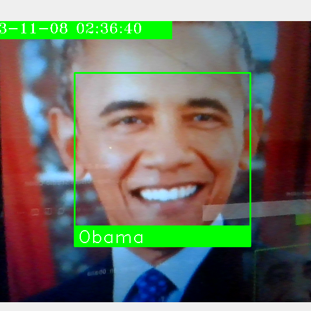

# Attendance System using Face recognition

**By** `Aidil`

## Introduction

This system uses face recognition to detect student face and store the attendance in a csv file for later use.

## How to use

1. Install python libraries requirement
```bash
pip3 install -r requirements.txt
```
> Note: use `pip` if you are using Windows

2. Add images

Add images to detect in `images` folder. By default theres an Obama image provided for you.

3. Run the file

```
python3 face.py
```

> Or in Windows
```bash
python face.py
```

4. Detect Face

Stand in front of the webcam to detect the face like this



5. Enjoy